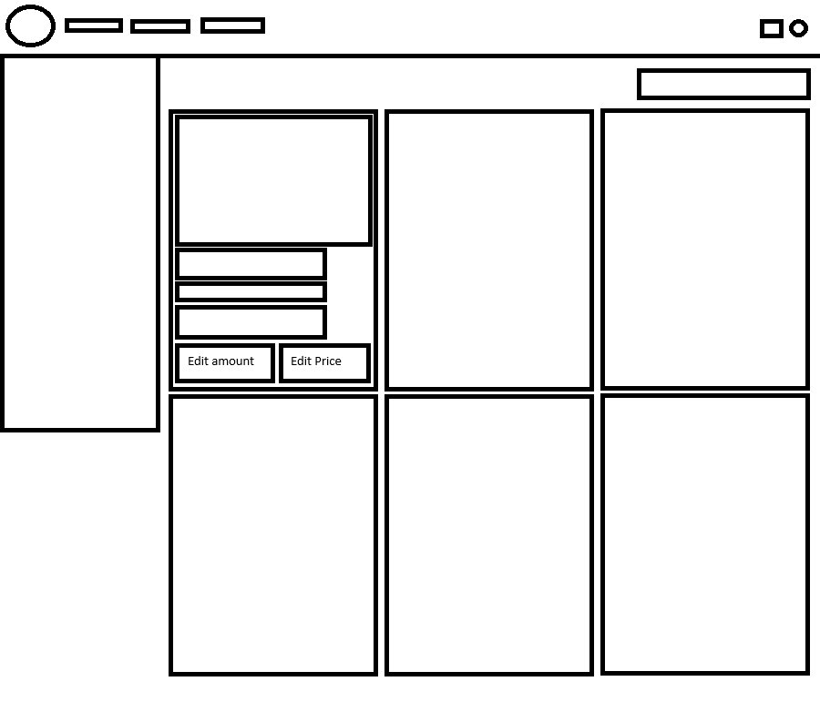
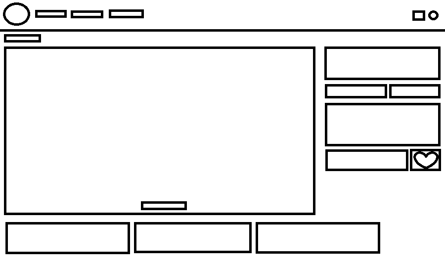
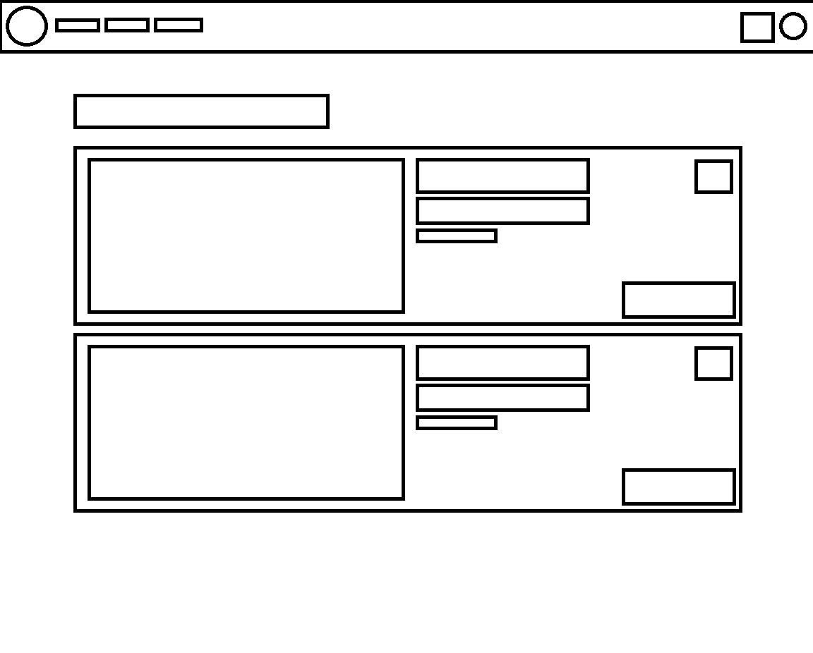
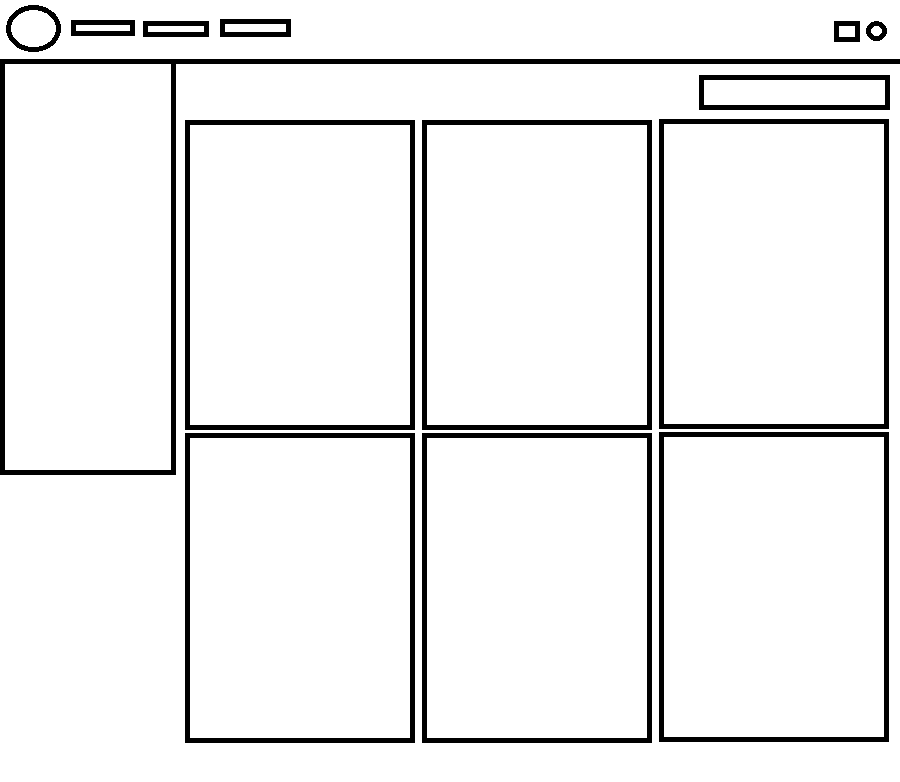
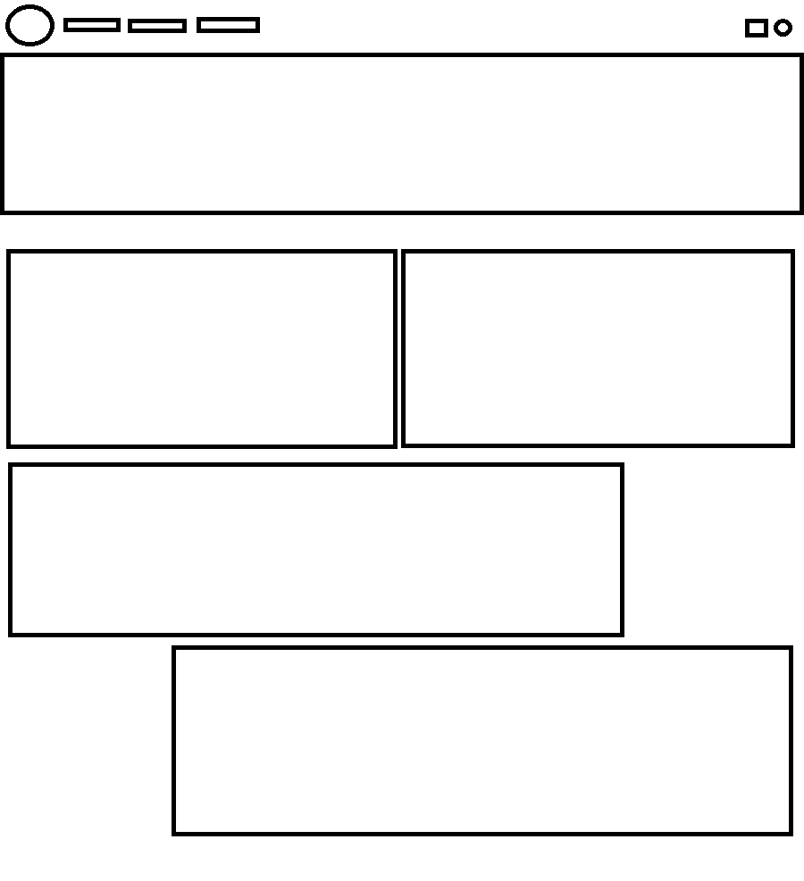

<h1>BMW Dealership 
Webshop</h1>

<h2>The pages</h2>

I have made a <a href="https://mateusz06.github.io/MSportDealership/">Visiterpage</a> 
I have made a <a href="https://mateusz06.github.io/MSportDealership/admin.html">Adminpage</a>

<h2>How to use the visiterpage</h2>
<h4>Step 1</h4>

When you are on the home page click on "All models" to see all models

<h4>Step 2</h4>

Choose a car you like and click on "View model" to go to the profile page of that car
 

<h4>Step 3</h4>

There you can add the car to your cart

<h4>For the future of the visiterpage</h4>

<li>More cars added</li>
<li>To make the design better</li>
<li>Add more html's</li>

<h2>How to use the adminpage</h2>
<h4>The all products page</h4>

You can see all products, add products, delete products and check the order

<h4>How to edit products</h4>

You can click on edit price or pack of the car and then click update to save your changes

<h4>What you can edit</h4>
<li>Price</li>
<li>Car Pack</li>

<h4>How to creat new products</h4>

CLick on the + button and there you can edit the product

<h4>The order page</h4>

Now when you go to the orders page you can see al the orders that are placed

<h4>For the future of the adminpage</h4>

<li>Better styling</li>
<li>Mobile Friendly</li>
<li>To make it more practical</li>

<h4>This was my sketch i made before i started </h4>

